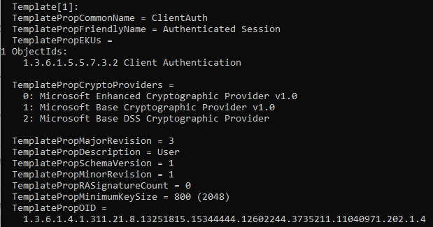

# AD Certificate Template  
This section explores the Active Directory Certificate Service and the misconfigurations seen with certificate templates.  
- How to enumerate misconfigured templates  
- Create a privileged escalation exploit using templates  

RDP into machine:
- Username: thm
- Password: Password1@
- Domain: lunar.eruca.com
 
# Certificate Templates
Windows Active Directory is not just used for identity and access management but provides a significant amount of services to help you run and manage organization.  

### Active Directory Certificate Services (AD CS)  
- MS Public Key Infrastructure implementation
- AD provides a level of trust in an organization
- Can be used as a Certificate Authority to prove and delegate trust
- Used for several things; encrypting file systems, creating + verifying digital signatures + user authentication

### Certificate Requests and Generation Flow

- AD CS normally runs on selected domain controllers (normal users are unable to interact with the service directly)
- Organizations can be too large to have an administrator + distribute each certificate manually; Certificate Templates
- Administrators of AD CS can create templates that can allow any user with relevant permissions to request a certificate
- Templates have parameters that say which user can request the certificate and what is required

### Terminology
`Public Key Infrastructure/PKI` : system that manages certificates and public key encryption  

`Active Directory Certificate Services/AD CS` : Microsoft PKI implementation which usually runs on domain controllers  

`Certificate Authority/CA` : is a PKI that issues certificates

`Certificate Template` : a collection of settings/policies that defines how and when a certificate may be issued by CA

`Certificate Signing Request/CSR` : is a message sent to a CA to request a signed certificate

`Extended Key Usage/EKU` : object identifiers that define how a generated certificate may be used

# Certificate Template Enumeration
Enumerate all certificate templates to identify vulnerable ones and understand what is required to exploit them.  

Windows has powerful built-in tools that can be used to enumerate all certificate templates and their associated policies.

### Certutil
If we have access to a domain-joined computer and authenticated to the domain, we can execute certuti (cmd) to enumerate all templates and store them in a file.  
<pre>certutil -v -template > cert_templates.txt</pre>

- Each template is denoted by Template[X] where X is the number

The specific parameter set that we are looking for is one that has the following:
-  A template where we have the relevant permissions to request the certificate
- A template that allows client authentication, use it for Kerberos authentication
- A template that allows us to edit the Subject Alternative Name (SAN)

### Parameter 1: Relevant Permissions
Permissions to generate a certificate request in order for exploit to work
- Template where user has `AllowEnrol` or `AllowFullControl` Permissions
- Certificate templates permissions are assigned to AD groups, not directly to AD users
- Grep for all Allow Enrol keywords + review output to see if any returned groups match the group that user belongs to

Find your own groups <pre>net user username /domain </pre>

2 groups that will be common for certificates:
- `Domain Users` : Authenticated users can request certificate
- `Domain Computers` : Machine account of a domain-joined host can request certificate

### Parameter 2 : Client Authentication
- Shorten list to certificate templates that we are allowed to request > ensure certificate has the Client Authentication EKU
- EKU > Certificate can be used for Kerberos authentication
- Review EKU properties of the template + ensure Client Authentication is provided

### Parameter 3 : Client Specifies SAN
- Verify that the template allows us (certificate client) to specify the SAN
- If we have ability to control SAN > leverage the certificate to generate a Kerberos ticket for any AD account

To find these templates, we grep for `CT_FLAG_ENROLLEE_SUPPLIES_SUBJECT` property flag = 1
- Indicates we can specify the SAN ourselves
- Find template where all 3 conditions are met
